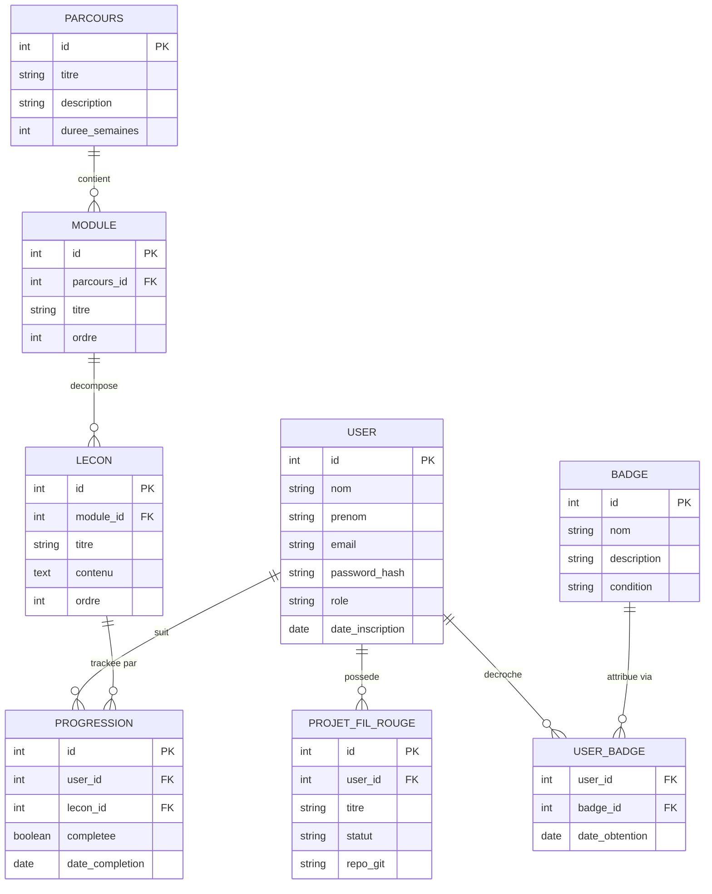

# 📊 StepByDev — Diagramme des tables

```mermaid
erDiagram
    USER {
        int id PK
        string nom
        string prenom
        string email
        string password_hash
        string role
        date date_inscription
    }

    PARCOURS {
        int id PK
        string titre
        string description
        int duree_semaines
    }

    MODULE {
        int id PK
        int parcours_id FK
        string titre
        int ordre
    }

    LECON {
        int id PK
        int module_id FK
        string titre
        text contenu
        int ordre
    }

    PROGRESSION {
        int id PK
        int user_id FK
        int lecon_id FK
        boolean completee
        date date_completion
    }

    PROJET_FIL_ROUGE {
        int id PK
        int user_id FK
        string titre
        string statut
        string repo_git
    }

    BADGE {
        int id PK
        string nom
        string description
        string condition
    }

    USER_BADGE {
        int user_id FK
        int badge_id FK
        date date_obtention
    }

    USER ||--o{ PROGRESSION : "suit"
    USER ||--o{ PROJET_FIL_ROUGE : "possede"
    USER ||--o{ USER_BADGE : "decroche"
    PARCOURS ||--o{ MODULE : "contient"
    MODULE ||--o{ LECON : "decompose"
    LECON ||--o{ PROGRESSION : "trackee par"
    BADGE ||--o{ USER_BADGE : "attribue via"
```
