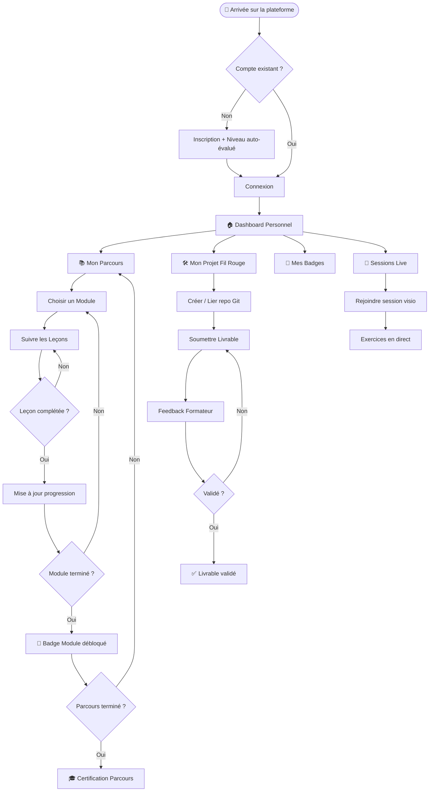

# 🔀 StepByDev — Flowchart MVP

```mermaid
flowchart TD
    A([🚀 Arrivée sur la plateforme]) --> B{Compte existant ?}
    B -- Non --> C[Inscription + Niveau auto-évalué]
    B -- Oui --> D[Connexion]
    C --> D

    D --> E[🏠 Dashboard Personnel]
    E --> F[📚 Mon Parcours]
    E --> G[🛠️ Mon Projet Fil Rouge]
    E --> H[🏅 Mes Badges]
    E --> I[📅 Sessions Live]

    F --> J[Choisir un Module]
    J --> K[Suivre les Leçons]
    K --> L{Leçon complétée ?}
    L -- Non --> K
    L -- Oui --> M[Mise à jour progression]
    M --> N{Module terminé ?}
    N -- Non --> J
    N -- Oui --> O[🏅 Badge Module débloqué]
    O --> P{Parcours terminé ?}
    P -- Non --> F
    P -- Oui --> Q[🎓 Certification Parcours]

    G --> R[Créer / Lier repo Git]
    R --> S[Soumettre Livrable]
    S --> T[Feedback Formateur]
    T --> U{Validé ?}
    U -- Non --> S
    U -- Oui --> V[✅ Livrable validé]

    I --> W[Rejoindre session visio]
    W --> X[Exercices en direct]
```
```

Commit con:
```
add: flowchart MVP StepByDev
