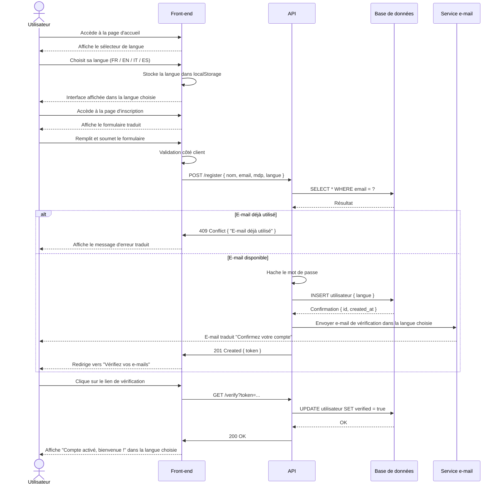

# 🔄 StepByDev — Diagramme de séquence : Inscription utilisateur

```mermaid
sequenceDiagram
    actor U as Utilisateur
    participant F as Front-end
    participant A as API
    participant DB as Base de données
    participant M as Service e-mail

    U->>F: Accède à la page d'accueil
    F-->>U: Affiche le sélecteur de langue
    U->>F: Choisit sa langue (FR / EN / IT / ES)
    F->>F: Stocke la langue dans localStorage
    F-->>U: Interface affichée dans la langue choisie

    U->>F: Accède à la page d'inscription
    F-->>U: Affiche le formulaire traduit

    U->>F: Remplit et soumet le formulaire
    F->>F: Validation côté client
    F->>A: POST /register { nom, email, mdp, langue }

    A->>DB: SELECT * WHERE email = ?
    DB-->>A: Résultat

    alt E-mail déjà utilisé
        A->>F: 409 Conflict { "E-mail déjà utilisé" }
        F-->>U: Affiche le message d'erreur traduit
    else E-mail disponible
        A->>A: Hache le mot de passe
        A->>DB: INSERT utilisateur { langue }
        DB-->>A: Confirmation { id, created_at }
        A->>M: Envoyer e-mail de vérification dans la langue choisie
        M-->>U: E-mail traduit "Confirmez votre compte"
        A->>F: 201 Created { token }
        F-->>U: Redirige vers "Vérifiez vos e-mails"
    end

    U->>F: Clique sur le lien de vérification
    F->>A: GET /verify?token=...
    A->>DB: UPDATE utilisateur SET verified = true
    DB-->>A: OK
    A->>F: 200 OK
    F-->>U: Affiche "Compte activé, bienvenue !" dans la langue choisie
```
