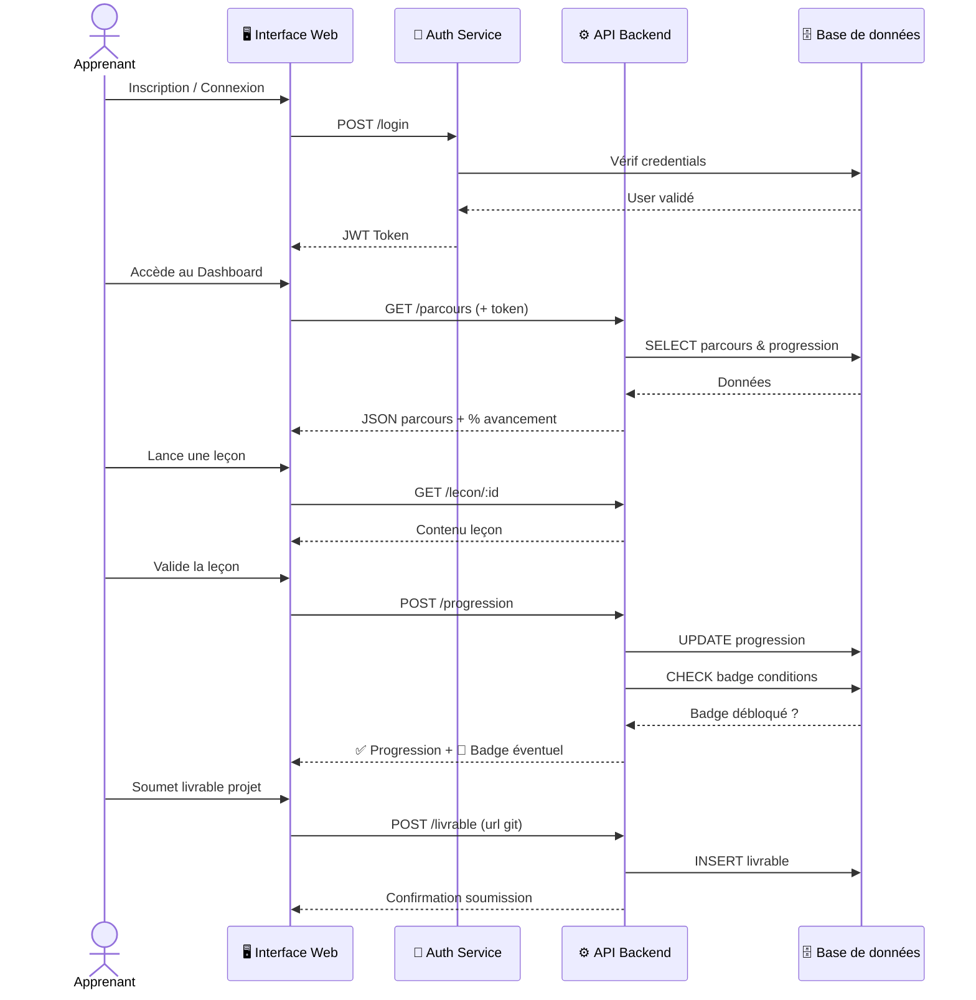

# 🔄 StepByDev — Diagramme de Séquence

## Parcours d'un apprenant

```mermaid
sequenceDiagram
    actor Apprenant
    participant Front as 🖥️ Interface Web
    participant Auth as 🔐 Auth Service
    participant API as ⚙️ API Backend
    participant DB as 🗄️ Base de données

    Apprenant->>Front: Inscription / Connexion
    Front->>Auth: POST /login
    Auth->>DB: Vérif credentials
    DB-->>Auth: User validé
    Auth-->>Front: JWT Token

    Apprenant->>Front: Accède au Dashboard
    Front->>API: GET /parcours (+ token)
    API->>DB: SELECT parcours & progression
    DB-->>API: Données
    API-->>Front: JSON parcours + % avancement

    Apprenant->>Front: Lance une leçon
    Front->>API: GET /lecon/:id
    API-->>Front: Contenu leçon

    Apprenant->>Front: Valide la leçon
    Front->>API: POST /progression
    API->>DB: UPDATE progression
    API->>DB: CHECK badge conditions
    DB-->>API: Badge débloqué ?
    API-->>Front: ✅ Progression + 🏅 Badge éventuel

    Apprenant->>Front: Soumet livrable projet
    Front->>API: POST /livrable (url git)
    API->>DB: INSERT livrable
    API-->>Front: Confirmation soumission
```
```

Commit con:
```
add: sequence diagram parcours apprenant StepByDev
